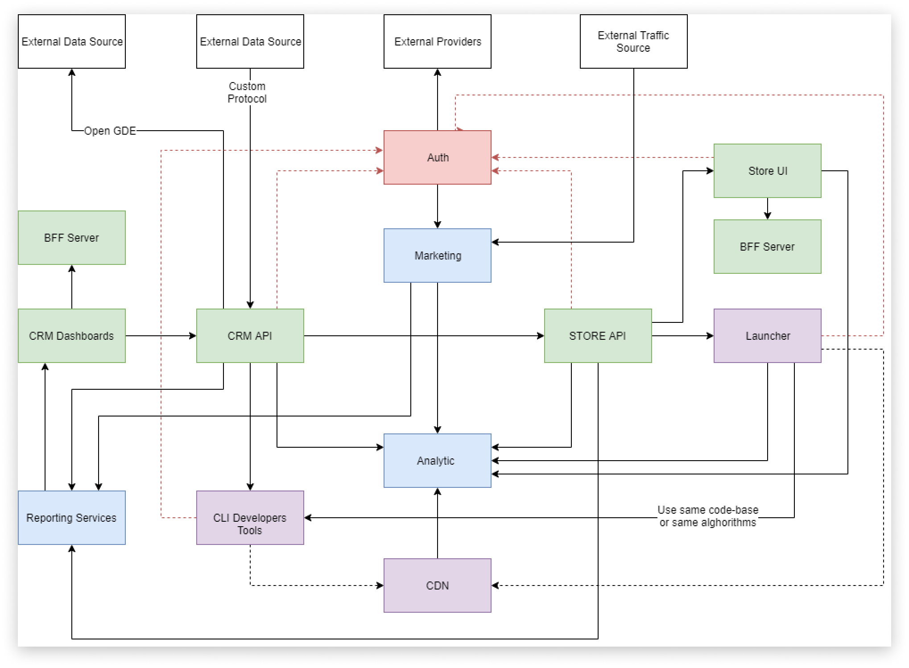

# Qilin CRM API

Qilin is an open-source digital distribution platform for game developers and publishers. Our mission is to distribute games by minimizing the effort of contracting, sharing documentation and providing comprehensive real-time statistics.

**Qilin architecture schema**

**Qilin CRM API** is an API server for the developer's portal Qilin CRM.

## Features

- TODO

---

## Table of Contents

- [Development](#development)
- [Usage](#usage)
- [Contributing](#contributing)
- [License](#license)

## Development

TODO

## Usage

TODO

## Contributing, Feature Requests and Support

If you like this project then you can put a ⭐ on it. It means a lot to us.

If you have an idea of how to improve Qilin (or any of the product parts) or have general feedback, you're welcome to submit a [feature request](../../issues/new?assignees=&labels=&template=feature_request.md&title=).

Chances are, you like what we have already but you may require a custom integration, a special license or something else big and specific to your needs. We're generally open to such conversations.

If you have a question and can't find the answer yourself, you can [raise an issue](../../issues/new?assignees=&labels=&template=support-request.md&title=I+have+a+question+about+%3Cthis+and+that%3E+%5BSupport%5D) and describe what exactly you're trying to do. We'll do our best to reply in a meaningful time.

Qilin welcomes contributions from anyone and everyone. Please refer to [our contribution guide to learn more](CONTRIBUTING.md).

## License

The project is available as open source under the terms of the [Apache-2.0 License](https://opensource.org/licenses/Apache-2.0).